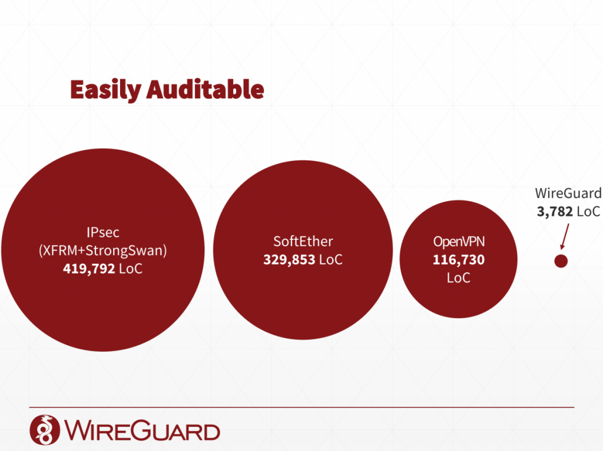
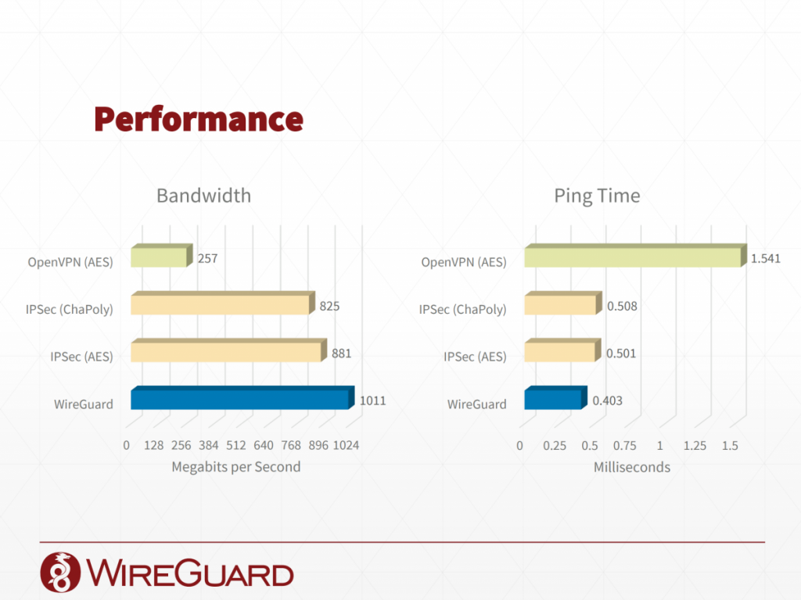

# Setup your own VPN server with WireGuard on Ubuntu

## Why WireGuard?

(1) It is very simple to setup a WireGuard VPN server. I have setup kinds of VPN servers, such like L2TP, IKEv2 and OpenVPN. The WireGuard is the most simple VPN server to be setup.

(2) See below graphs.

## Chapter 1 Server Side Configuration

